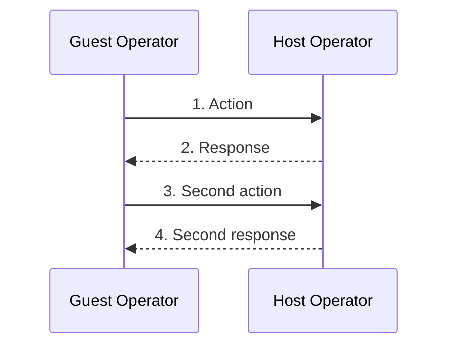
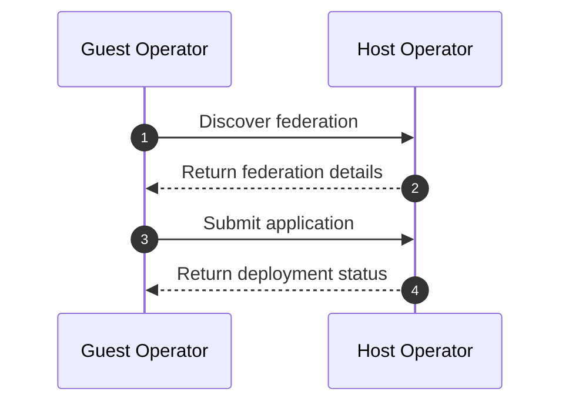

# Contributing to opg-ewbi-documentation

Thank you for your interest in contributing to the Katalis documentation!

This repository contains the project documentation for the Katalis East-Westbound Interface (EWBI) and related federation functionality. Contributions are welcome from everyone involved in the project and the wider community.

These guidelines provide a lightweight set of conventions to help keep the documentation clear, consistent and easy to maintain.

---

## 1. What can you contribute?

Contributions to this repository can include:

- Improving existing documentation
- Fixing spelling, grammar or formatting
- Correcting technical inaccuracies
- Adding missing information
- Improving explanations for new contributors
- Adding or improving diagrams
- Improving examples and tutorials
- Adding or updating deployment and testing documentation
- Updating links and references
- Improving the organisation and navigation of the documentation

If you are unsure whether a change belongs in this repository, feel free to open an issue or discuss it with the project maintainers.

---

## 2. Commits

We follow [Conventional Commits](https://www.conventionalcommits.org/en/v1.0.0/).

Commit messages should use the following format:

    <type>(<scope>): <short summary>

    <optional body>

    <optional footer(s)>

### Allowed types

| Type | When to use |
|---|---|
| `docs` | Documentation changes |
| `fix` | Correcting an error or inaccurate information |
| `feat` | Adding new documentation or a significant new documentation feature |
| `refactor` | Restructuring documentation without substantially changing its content |
| `chore` | Repository maintenance or tooling changes |
| `ci` | CI/CD changes |

For most contributions to this repository, `docs`, `fix` or `refactor` will be the appropriate type.

### Scope

A scope is optional but encouraged when it helps identify the area affected.

For example:

    docs(architecture): clarify federation architecture
    docs(deployment): update Kind deployment instructions
    fix(quick-start): correct operator terminology
    docs(federation): add resource relationship diagram

### Commit rules

1. **Keep the subject line concise.** Prefer a short summary of the change.
2. **Use imperative language**, for example `update` rather than `updated`.
3. **Keep commits focused.** Each commit should represent one logical change.
4. **Include a body when useful.** Use it to provide additional context for changes that may not be obvious from the subject.
5. **Use the `-s` flag when committing.** All commits should include a `Signed-off-by` line using the email address configured in Git.

For example:

    git commit -s -m "docs(architecture): clarify federation architecture"

The `-s` flag adds a line similar to:

    Signed-off-by: Your Name <your.email@example.com>

Make sure your Git identity is configured correctly before committing.

You can check your configured identity with:

    git config user.name
    git config user.email

If necessary, configure them with:

    git config user.name "Your Name"
    git config user.email "your.email@example.com"

### Examples

    docs(architecture): clarify federation architecture

    fix(quick-start): correct EWBI terminology

    docs(deployment): update Kind installation instructions

    refactor(federation): restructure resource relationship documentation

---

## 3. Pull Requests

### Keep PRs focused

Each PR should represent a logical unit of documentation work.

For example:

- Update the federation architecture documentation
- Add a new deployment guide
- Improve the Quick Start Guide
- Correct terminology throughout the documentation
- Add or update architecture diagrams
- Question on reorganising structure

Larger documentation changes are fine when they form part of a single coherent piece of work, but unrelated changes should preferably be submitted as separate PRs.

### PR description

Please provide enough information for reviewers to understand the change.

Where appropriate, include:

1. **What** — what documentation has changed?
2. **Why** — why was the change needed?
3. **How** — how has the documentation been changed?
4. **Testing/Review** — what has been checked?
5. **Breaking changes** — state whether the documentation change reflects any breaking or significant project changes.

For documentation-only changes, "Testing" may simply describe the checks that were performed, such as reviewing links, rendering diagrams or verifying the documentation against the current implementation.

### Branch naming

Use the pattern:

    <type>/<short-description>

Examples:

    docs/update-federation-guide
    docs/improve-quick-start
    fix/deployment-links
    docs/add-architecture-diagram

---

## 4. Before opening a PR

Before opening a pull request, please check:

- [ ] The documentation accurately reflects the current implementation
- [ ] Spelling and grammar have been reviewed
- [ ] Markdown formatting is correct
- [ ] Internal documentation links work
- [ ] External links are still relevant
- [ ] Images and diagrams are present and referenced correctly
- [ ] Mermaid diagrams render correctly, where applicable
- [ ] Terminology is consistent throughout the documentation
- [ ] The PR description is filled in
- [ ] Commits follow the Conventional Commits format
- [ ] Commits include the required `Signed-off-by` line using `git commit -s`

For changes involving technical behaviour or architecture, please verify the documentation against the relevant implementation or specification where possible.

---

## 5. Documentation style

Documentation should aim to be clear and useful to both new and existing contributors.

### Write for the reader

Prefer clear explanations over implementation-specific terminology where possible.

When introducing a technical term or abbreviation, explain it the first time it is used.

### Keep terminology consistent

Use the terminology defined by the relevant GSMA specifications and project documentation.

If the terminology used by the documentation differs from the terminology used by the current implementation, please raise this during review rather than silently introducing a new term.

### Use examples where helpful

Examples can make technical concepts significantly easier to understand.

Where appropriate, use:

- Code blocks
- Configuration examples
- Diagrams
- Tables
- Step-by-step instructions

Examples should be kept up to date with the current implementation.

### Prefer links over duplication

If information is already documented elsewhere in the project, link to the existing documentation rather than maintaining multiple copies of the same information.

External specifications and authoritative references should also be linked where they provide useful additional context.

---

## 6. Mermaid diagrams

Mermaid diagrams are used to describe architecture, workflows, resource relationships, sequences and other technical concepts.

When adding or modifying a Mermaid diagram:

- Keep the diagram focused on the concept being explained.
- Use the same terminology as the surrounding documentation.
- Make relationships, directions and dependencies explicit where relevant.
- Keep diagrams as simple as possible while still conveying the required information.
- Prefer Mermaid over static images when the diagram can be represented clearly in Mermaid.
- Use the appropriate Mermaid diagram type for the concept being described.
- Ensure Mermaid syntax is valid and the diagram renders correctly.
- Check the rendered diagram rather than relying only on the source syntax.
- Keep node names and labels concise and readable.
- Avoid unnecessarily complex diagrams that are difficult to understand or maintain.
- Make sure changes to a diagram remain consistent with the surrounding text.

Common Mermaid diagram types used in the documentation include:

- `flowchart` — architecture, relationships and workflows
- `sequenceDiagram` — interactions between components or operators over time
- `classDiagram` — relationships between data structures or resources
- `stateDiagram` — resource or component state transitions

### Numbering steps in diagrams

When a Mermaid diagram represents a **sequence of actions or a workflow**, number the steps where this helps the reader understand the order in which events occur.

For example:

Numbering is particularly helpful and should be used where appropriate.

For more complex workflows, numbering can also be combined with Mermaid's `autonumber` functionality where appropriate:

Use explicit numbering in the message text when the numbers need to be referenced directly by the surrounding documentation. Use `autonumber` when the sequence is straightforward and the numbers are primarily intended to make the diagram easier to follow.

### Mermaid and technical accuracy

A Mermaid diagram is part of the documentation and should be treated in the same way as written technical content.

When modifying a diagram that describes the implementation:

1. Verify that the relationships and directions are correct.
2. Check that terminology matches the implementation and relevant specifications.
3. Check that the diagram does not contradict the accompanying text.
4. Check that any numbering reflects the actual sequence of events.
5. Review any related diagrams for consistency.
6. Render the diagram before submitting the PR.

If a diagram represents a technical change or an area where the implementation is unclear, raise the uncertainty in the PR rather than making an assumption.

### Mermaid formatting

Where possible:

- Use meaningful node names.
- Avoid excessive text inside nodes.
- Use consistent naming across related diagrams.
- Keep arrows and relationships easy to follow.
- Break very large diagrams into smaller diagrams where appropriate.
- Use comments in the Mermaid source when they help explain a non-obvious part of the diagram.
- Use numbering when it materially improves the reader's understanding of a workflow.
- Keep numbering consistent between diagrams and the surrounding documentation.

The goal is for diagrams to remain understandable to someone who is unfamiliar with the implementation while still being technically accurate for existing contributors.

---

## 7. Images and other visual assets

Images and diagrams are an important part of the project documentation.

When adding or modifying static images:

- Store repository images in the appropriate `docs/images/` directory.
- Use meaningful filenames.
- Check that image paths work from the page where the image is referenced.
- Use appropriate image formats and resolutions.
- Make sure the image is understandable in the context of the surrounding documentation.

When a static image duplicates something that could reasonably be maintained as Mermaid, consider using Mermaid instead.

---

## 8. Technical accuracy

Because this repository documents the implementation and architecture of Katalis, technical accuracy is particularly important.

When making technical changes to the documentation, check the relevant:

- Katalis implementation
- Kubernetes resources and APIs
- EWBI APIs and specifications
- GSMA documentation
- Deployment configuration
- Existing project documentation

If you are unsure about a technical detail, flag it in the PR rather than making an assumption.

Documentation reviewers may request changes where the documentation does not accurately reflect the current implementation or agreed project terminology.

---

## 9. Code Review

All documentation changes are reviewed through GitHub pull requests.

Reviewers may provide feedback on:

- Technical accuracy
- Clarity
- Terminology
- Structure and organisation
- Grammar and readability
- Links and references
- Mermaid diagrams and other visual explanations
- Consistency with the current implementation

Please address review comments before requesting final approval.

If you disagree with a review comment, discuss the reasoning in the PR rather than simply ignoring the comment. Technical disagreements are often useful discussions and can help improve the documentation.

When addressing review feedback, prefer clear, focused commits so that reviewers can easily understand what has changed.

---

## 10. Issues and larger documentation changes

For larger documentation changes, consider opening an issue or discussing the proposed change before starting work.

This can be particularly useful when:

- A new documentation section is being proposed
- The existing documentation structure needs to change
- There is disagreement about terminology
- Documentation requires significant changes to reflect the implementation
- Multiple documents need to be changed together
- A new or substantially different architecture diagram is being proposed

This helps avoid duplicated work and gives maintainers and contributors an opportunity to agree on the approach before significant work begins.

---

## 11. Thank you

Thank you for helping improve the Katalis documentation.

Clear and accurate documentation makes the project easier to understand, deploy, contribute to and use, and your contributions are appreciated.